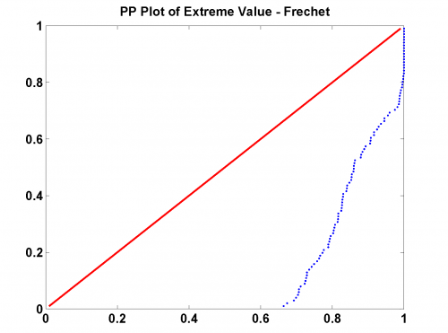
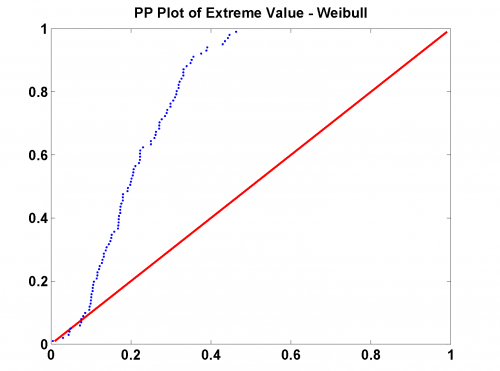

[](http://quantlet.de/)

## [](http://quantlet.de/) **MSRevt2** [](http://quantlet.de/)

```yaml

Name of Quantlet: MSRevt2

Published in: Measuring Statistical Risk

Description:  'Generates CDFs for normal distribution of a pseudo random variable with extreme value ( Gumbel, Frechet and Weibull) and a randomnormal distributed variable.'

Keywords: Frechet, Weibull, gumbel, extreme-value, distribution

See also: MSRevt1, MSRevt3

Author: Ye Hua, Zografia Anastasiadou
Author[Matlab]: Juergen Franke

```





### R Code
```r


rm(list = ls(all = TRUE))
#setwd("C:/...")

#install.packages("evd")
library(evd)

set.seed(123)
n  =  100

# Gumbel
gumb1  =  rgev(n)
gumb2  =  sort(gumb1)
gumb   =  pnorm(gumb2)
t      =  c(1:n)/(n + 1)
dat    =  cbind(t, t)

plot(gumb, t, col = "blue", pch = 20, xlab = "", ylab = "", 
    main = "PP Plot of Extreme Value - Gumbel")
lines(dat, col = "red", lwd = 3)

alpha  =  0.5

# Frechet
frec1  =  rgev(n, 1, alpha, alpha)
frec2  =  sort(frec1)
frec   =  pnorm(frec2)
t      =  c(1:n)/(n + 1)
dat    =  cbind(t, t)

plot(frec, t, col = "blue", pch = 20, xlim = c(0, 1), ylim = c(0, 1), xlab = "", ylab = "", main = "PP Plot of Extreme Value - Frechet")
lines(dat, col = "red", lwd = 3)

# Weibull
weib1  =  rgev(n, -1, alpha, -alpha)
weib2  =  sort(weib1)
weib   =  pnorm(weib2)
t      =  c(1:n)/(n + 1)
dat    =  cbind(t, t)

plot(weib, t, col = "blue", pch = 20, xlim = c(0, 1), ylim = c(0, 1), 
    xlab = "", ylab = "", main = "PP Plot of Extreme Value - Weibull") 
lines(dat, col = "red", lwd = 3)
```

automatically created on 2018-05-28

### MATLAB Code
```matlab

n = 100;

% Gumbel
gumb1 = gevrnd(0,1,0,100,1)
gumb2 = sort(gumb1);
gumb  = normcdf(gumb2,0,1);

t     = (1:n)/(n + 1);

hold on
figure(1)
plot(t, t, 'r', 'LineWidth', 2)
scatter(gumb, t, '.', 'b')
hold off
title('PP Plot of Extreme Value - Gumbel')

% Frechet
frec1 = gevrnd(0.5, 0.5, 1, 100, 1);
frec2 = sort(frec1);
frec  = normcdf(frec2, 0,1);

t     = (1:n)/(n + 1);

figure(2)
hold on
plot(t, t, 'r', 'LineWidth', 2)
scatter(frec, t, '.', 'b')
hold off
xlim([0 1])
ylim([0 1])
title('PP Plot of Extreme Value - Frechet')

% Weibull
weib1 = gevrnd(-0.5, 0.5, -1, 100, 1);
weib2 = sort(weib1);
weib  = normcdf(weib2, 0, 1);

t     = (1:n)/(n + 1);

figure(3)
hold on
plot(t, t, 'r', 'LineWidth', 2)
scatter(weib, t, '.', 'b')
hold off
xlim([0 1])
ylim([0 1])
title('PP Plot of Extreme Value - Weibull')


```

automatically created on 2018-05-28