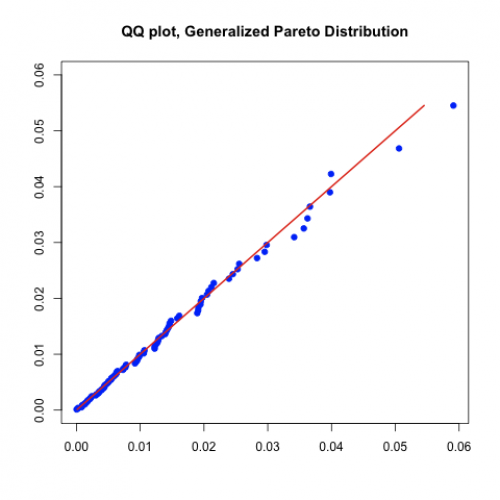

[](http://quantlet.de/)

## [](http://quantlet.de/) **MSRtailGPareto** [](http://quantlet.de/)

```yaml

Name of Quantlet: MSRtailGPareto

Published in: Measuring Statistical Risk

Description: 'Estimates the parameters of Generalized Pareto Distribution for the negative log-returns of portfolio (Bayer, BMW, Siemens), time period: from 1992-01-01 to 2006-09-21, and produces QQ-plot and PP-plot.'

Keywords: plot, pareto, pp-plot, qq-plot, portfolio, financial, dax, tail, tail area (of a distribution)

Author: Zografia Anastasiadou

Submitted: Thu, December 22 2011 by Dedy Dwi Prastyo

Datafiles: 'Bay9906_close_2kPoints.txt, Bmw9906_close_2kPoints.txt, Sie9906_close_2kPoints.txt'
```



### R Code
```r


rm(list = ls(all = TRUE))
#setwd("C:/....")

#install.packages("QRM")
library(QRM)

a    = read.table('Bay9906_close_2kPoints.txt')
b    = read.table('Bmw9906_close_2kPoints.txt')
c    = read.table('Sie9906_close_2kPoints.txt')
d    = a + b + c

n1   = dim(d)[1]
x    = log(d[1:n1-1, ]/d[2:n1, ]) #negative log-returns
n    = 100                     

gpd  = fit.GPD(x, nextremes = n, information = "observed") 
t    = (1:n)/(n+1)
y1   = qGPD(t, gpd$par.ests[1], gpd$par.ests[2])                   
 
gpdt = sort(gpd$data) - gpd$threshold                             
y2   = pGPD(gpdt, gpd$par.ests[1], gpd$par.ests[2])            
                                                    
plot(gpdt, y1, col = "blue", pch = 21, bg = "blue", ylim = c(0, 0.06), xlab = "",
    ylab = "", main = "QQ plot, Generalized Pareto Distribution")
lines(y1, y1, type = "l", col = "red", lwd = 2)  

plot(y2, t, col = "blue", pch = 21, bg = "blue", xlab = "", ylab = "", 
    main = "PP plot, Generalized Pareto Distribution")
lines(y2, y2, type = "l", col = "red", lwd = 2)


```

automatically created on 2018-05-28

### MATLAB Code
```matlab

clc;
close all

a      = load('Bay9906_close_2kPoints.txt', '-ascii');
b      = load('Bmw9906_close_2kPoints.txt', '-ascii');
c      = load('Sie9906_close_2kPoints.txt', '-ascii');
d      = a + b + c;
x      = log(d(1:end-1))-log(d(2:end));%negative log-returns
n      = 100;
zb     = sort(x);
theta  = zb(end-n);
z      = zb(end-n+1:end)-theta;
params = gpfit(z);
K      = params(1)
sigma  = params(2);
t      = (1:n)/(n+1);
y      = gpinv(t, K, sigma);
hold on
plot(y, y, 'r', 'LineWidth', 2)
scatter(z, y, '.')
title('QQ plot,  Generalized Pareto Distribution')
hold off
%---------------------------------------------------------------------
figure
y = gpcdf(z, K, sigma);
hold on
plot(y, y, 'r', 'LineWidth', 2)
scatter(y, t, '.')
title('PP plot,  Generalized Pareto Distribution')
hold off

```

automatically created on 2018-05-28