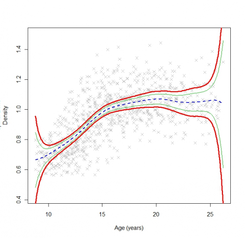

[](http://quantlet.de/)

## [](http://quantlet.de/) **concorpanel** [](http://quantlet.de/)

```yaml

Name of QuantLet: concorpanel

Published in: Measuring Statistical Risk

Description: 'Produces a plot of confidence intervals and confidence bands for dataset of measurements of spinal bone mineral density at 99% level.'

Keywords: 'nonparametric, quantile, plot, graphical representation, data visualization'

Author: 'Shuzhuan Zheng, Lijian Yang, Wolfgang Härdle'

Datafiles: 'bone.txt'

```



### R Code
```r

graphics.off()
rm(list = ls(all = TRUE))

#modify working directory here:
#setwd("C:/...")

#required packages
libraries = c("lpridge", "KernSmooth", "stats", "locpol")
lapply(libraries, function(x) if (!(x %in% installed.packages())) {
  install.packages(x)
})

library("KernSmooth")
library("lpridge")
library("stats")
library("locpol")

bone.data = read.table("bone.txt", sep = ";", dec = ".", header = T)

# age
x = bone.data[, 3];

# spinal bone density
y = bone.data[, 5]; 

# rescale x
x_new = (x-min(x))/(max(x)-min(x)); 
n     = 286;  # no. of individuals
NT    = 860; # no. of observations

# scatter plot
plot(x, y, pch = 4, col = 8, xlab = "Age (years)", ylab = "Spinal Bone Density", 
    ylim = c(0.42,1.5)); 

# bandwidth for LLE
h    = NT^(- .2) * (log(n))^(- 1) 

# local linear estimator
mean = locpoly(x_new, y, degree = 1, range.x = c(0, 1), kernel = "quadratic", 
    gridsize = 400, bandwidth = h,truncate = TRUE); 

# plot est mean
lines(mean$x * (max(x) - min(x)) + min(x), mean$y, col = 4,lwd = 2,lty = 8); 

# est density func of x
xden = bkde(x_new, kernel = "epanech", canonical = FALSE, bandwidth=0.1,
        gridsize = 400, range.x=c(0,1), truncate = TRUE); 

# est variance func of y
var   = lpepa(x_new, y, bandwidth=0.1, deriv = 0, n.out = 400, x.out = NULL,
        order = 1, mnew = 1, var = TRUE); 

# confidence level = 99%
alpha = 0.01; 
sigma = sqrt(var$est.var*(5/7)/(h*NT*xden$y)); 

#quantile
quant = sqrt(-2*log(h)) + (1/sqrt(-2*log(h)))*(0.5*log(3) - log(2*pi) - log(-log(1 - alpha)/2)); 

# 99%CI (above) 
lines(mean$x * (max(x) - min(x)) + min(x), mean$y + qnorm(0.995)*sigma, 
    col = 3, lwd = 0); 

# 99%CI (below)
lines(mean$x * (max(x) - min(x)) + min(x), mean$y - qnorm(0.995)*sigma,
    col = 3, lwd = 0); 

# 99% CB (above)
lines(mean$x * (max(x) - min(x)) + min(x), mean$y + quant*sigma,
    col = 2, lwd = 3); 

# 99% CB (below)
lines(mean$x * (max(x) - min(x)) + min(x), mean$y - quant*sigma,
    col = 2, lwd = 3); 


```

automatically created on 2018-05-28